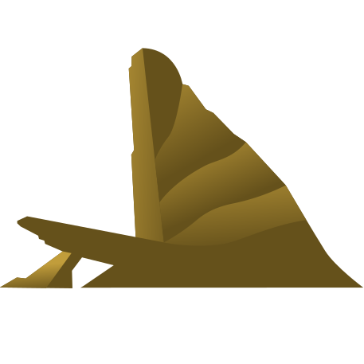

<p align="center">
  
  <h1 style="text-align: center;">Lion</h1>
</p>

<p align="center">
  <a href="https://github.com/modernweb-dev/rocket/actions"
    ></a>
  <a href="https://github.com/modernweb-dev/rocket/actions"
    ></a>
  <a href="https://www.tickgit.com/browse?repo=github.com/ing-bank/lion"
    ></a>
</p>

<p align="center">
  <a href="https://lion-web.netlify.app">Website</a>
  ·
  <a href="https://lion-web.netlify.app/guides/">Guides</a>
  ·
  <a href="https://lion-web.netlify.app/components/">Components</a>
  ·
  <a href="https://lion-web.netlify.app/docs/">Documentation</a>
  ·
  <a href="https://lion-web.netlify.app/blog/">Blog</a>
</p>

**Lion is a set of highly performant, accessible and flexible Web Components.!**

They provide an unopinionated, white-label layer that can be extended to your own layer of components.

- **High Performance:** Focused on great performance in all relevant browsers with a minimal number of dependencies.
- **Accessibility:** Aimed at compliance with the WCAG 2.1 AA standard to create components that are accessible for everybody.
- **Flexibility:** Provides solutions through Web Components and JavaScript classes which can be used, adopted and extended to fit all needs.
- **Modern Code:** Lion is distributes as pure es modules.
- **Exposes functions/classes and Web Components:** Ships a functionality in it's most appropriate form.

> Note: Our demos may look a little bland but that is on purpose. They only come with functional stylings.
> This makes sense as the main use case is to extend those components and if you do you do not want to override existing stylings.

<p align="center">
  <a href="https://lion-web.netlify.app/guides/"><strong>Explore the Lion Guides&nbsp;&nbsp;▶</strong></a>
</p>

## How to install

```bash
npm i @lion/<package-name>
```

## How to use

### Extend a Web Component

**This is the main use case for lion**. To import component classes, and extend them for your own design system's components.

```js
import { css } from 'lit';
import { LionInput } from '@lion/input';

class MyInput extends LionInput {
  static get styles() {
    return [
      super.styles,
      css`
        /* your styles here */
      `,
    ];
  }
}
customElements.define('my-input', MyInput);
```

### Use a JavaScript system

There's a couple of "systems" in lion which have a JavaScript API. Examples are `localize`, `overlays`, `ajax`, etc.

```html
<script type="module">
  import { ajax } from '@lion/ajax';

  ajax
    .fetch('data.json')
    .then(response => response.json())
    .then(data => {
      // do something with the data
    });
</script>
```

### Use a Web Component

You can also use the lion elements directly, although this is likely not a common use case.

```html
<script type="module">
  import '@lion/input/define';
</script>

<lion-input name="firstName"></lion-input>
```

## Issues

If you encounter an issue with any of the packages we are offering please open a [new bug issue](https://github.com/ing-bank/lion/issues/new?assignees=&labels=&template=bug_report.md&title=). Be sure to include a description of the expected and the current behavior - additional adding a [reproduction](https://webcomponents.dev/edit/kpZmz1CJN580OaXsk56f?pm=1) always helps.

## Feature requests

When you have an idea on how we could improve, please check our [discussions](https://github.com/ing-bank/lion/discussions) to see if there are similar ideas or feature requests. If there are none, please [start](https://github.com/ing-bank/lion/discussions/new) your feature request as a new discussion topic. Add the title `[Feature Request] My awesome feature` and a description of what you expect from the improvement and what the use case is.

## Content

Lion web components is logically organized in groups of systems.

The accessibility column indicates whether the functionality is accessible in its core. Aspects like styling and content determine actual accessibility in usage.

| Package                                                                                           | Version                                                                                                                                 | Description                                                                                    | Accessibility              |
| ------------------------------------------------------------------------------------------------- | --------------------------------------------------------------------------------------------------------------------------------------- | ---------------------------------------------------------------------------------------------- | -------------------------- |
| **-- [Form System](https://lion-web.netlify.app/fundamentals/systems/form/overview/) --**         |                                                                                                                                         | A system that lets you make complex forms with ease, including: validation, translations.      | ✔️                         |
| [combobox](https://lion-web.netlify.app/components/combobox/overview/)                            | [](https://www.npmjs.com/package/@lion/form)                                | Text box controlling popup listbox                                                             | ✔️                         |
| [form](https://lion-web.netlify.app/components/form/overview)                                     | [](https://www.npmjs.com/package/@lion/form)                                        | Wrapper for multiple form elements                                                             | ✔️                         |
| [form-core](https://lion-web.netlify.app/fundamentals/systems/form/overview/)                     | [](https://www.npmjs.com/package/@lion/form-core)                         | Core functionality for all form controls                                                       | ✔️                         |
| [form-integrations](https://lion-web.netlify.app/fundamentals/systems/form/overview/)             | [](https://www.npmjs.com/package/@lion/form-integrations) | Shows form elements in an integrated way                                                       | ✔️                         |
| [fieldset](https://lion-web.netlify.app/components/fieldset/overview/)                            | [](https://www.npmjs.com/package/@lion/fieldset)                            | Group for form inputs                                                                          | ✔️                         |
| [checkbox-group](https://lion-web.netlify.app/components/checkbox-group/overview/)                | [](https://www.npmjs.com/package/@lion/checkbox-group)          | Group of checkboxes                                                                            | ✔️                         |
| [input](https://lion-web.netlify.app/components/input/overview/)                                  | [](https://www.npmjs.com/package/@lion/input)                                     | Input element for strings                                                                      | ✔️                         |
| [input-amount](https://lion-web.netlify.app/components/input-amount/overview/)                    | [](https://www.npmjs.com/package/@lion/input-amount)                | Input element for amounts                                                                      | ✔️                         |
| [input-date](https://lion-web.netlify.app/components/input-date/overview/)                        | [](https://www.npmjs.com/package/@lion/input-date)                      | Input element for dates                                                                        | ✔️                         |
| [input-datepicker](https://lion-web.netlify.app/components/input-datepicker/overview/)            | [](https://www.npmjs.com/package/@lion/input-datepicker)    | Input element for dates with a datepicker                                                      | ✔️                         |
| [input-email](https://lion-web.netlify.app/components/input-email/overview/)                      | [](https://www.npmjs.com/package/@lion/input-email)                   | Input element for e-mails                                                                      | ✔️                         |
| [input-iban](https://lion-web.netlify.app/components/input-iban/overview/)                        | [](https://www.npmjs.com/package/@lion/input-iban)                      | Input element for IBANs                                                                        | ✔️                         |
| [input-range](https://lion-web.netlify.app/components/input-range/overview/)                      | [](https://www.npmjs.com/package/@lion/input-range)                   | Input element for a range of values                                                            | ✔️                         |
| [input-stepper](https://lion-web.netlify.app/components/input-stepper/overview/)                  | [](https://www.npmjs.com/package/@lion/input-stepper)             | Input stepper element for the predefined range                                                 | ✔️                         |
| [listbox](https://lion-web.netlify.app/components/listbox/overview/)                              | [](https://www.npmjs.com/package/@lion/form)                                  | Interactive list with selectable options                                                       | ✔️                         |
| [radio-group](https://lion-web.netlify.app/components/radio-group/overview/)                      | [](https://www.npmjs.com/package/@lion/radio-group)                   | Group of radios                                                                                | ✔️                         |
| [select](https://lion-web.netlify.app/components/select/overview/)                                | [](https://www.npmjs.com/package/@lion/select)                                  | Simple native dropdown element                                                                 | ✔️                         |
| [select-rich](https://lion-web.netlify.app/components/select-rich/overview/)                      | [](https://www.npmjs.com/package/@lion/select-rich)                   | 'rich' version of the native dropdown element                                                  | [#243][i243]               |
| [textarea](https://lion-web.netlify.app/components/textarea/overview/)                            | [](https://www.npmjs.com/package/@lion/textarea)                            | Multiline text input                                                                           | ✔️                         |
| **-- [Button System](https://lion-web.netlify.app/components/buttons-intro--page) --**            |                                                                                                                                         | These web components bring common UX patterns while still full integrated with (native) forms. |                            |
| [button](https://lion-web.netlify.app/components/button/overview/)                                | [](https://www.npmjs.com/package/@lion/button)                                  | Button                                                                                         | ✔️                         |
| [switch](https://lion-web.netlify.app/components/switch/overview/)                                | [](https://www.npmjs.com/package/@lion/switch)                                  | Switch                                                                                         | ✔️                         |
| **-- [Overlay System](https://lion-web.netlify.app/components/overlays-intro--page) --**          |                                                                                                                                         | If something needs to overlay content this is your place.                                      |                            |
| [overlays](https://lion-web.netlify.app/fundamentals/systems/overlays/overview/)                  | [](https://www.npmjs.com/package/@lion/overlays)                            | Overlay System                                                                                 | ✔️                         |
| [dialog](https://lion-web.netlify.app/components/dialog/overview/)                                | [](https://www.npmjs.com/package/@lion/dialog)                                  | Dialog element                                                                                 | ✔️                         |
| [tooltip](https://lion-web.netlify.app/components/tooltip/overview/)                              | [](https://www.npmjs.com/package/@lion/tooltip)                               | Tooltip element                                                                                | [#175][i175]               |
| **-- [Navigation System](https://lion-web.netlify.app/components/navigation-intro--page) --**     |                                                                                                                                         | Components which are used to guide users                                                       |                            |
| [accordion](https://lion-web.netlify.app/components/accordion/overview/)                          | [](https://www.npmjs.com/package/@lion/accordion)                         | Accordion                                                                                      | ✔️                         |
| [pagination](https://lion-web.netlify.app/components/pagination/overview/)                        | [](https://www.npmjs.com/package/@lion/pagination)                      | Pagination                                                                                     | ✔️                         |
| [steps](https://lion-web.netlify.app/components/steps/overview)                                   | [](https://www.npmjs.com/package/@lion/steps)                                     | Multi Step System                                                                              | n/a                        |
| [tabs](https://lion-web.netlify.app/components/tabs/overview)                                     | [](https://www.npmjs.com/package/@lion/tabs)                                         | Move between a small number of equally important views                                         | n/a                        |
| **-- [localize System](https://lion-web.netlify.app/fundamentals/systems/localize/overview/) --** |                                                                                                                                         | Localize text, numbers, dates and a way to store/fetch these data.                             |                            |
| [localize](https://lion-web.netlify.app/fundamentals/systems/localize/overview/)                  | [](https://www.npmjs.com/package/@lion/localize)                            | Localize and translate your application/components                                             | n/a                        |
| **-- [Icon System](https://lion-web.netlify.app/fundamentals/systems/icon/overview/) --**         |                                                                                                                                         | Loading and displaying icons                                                                   |                            |
| [icon](https://lion-web.netlify.app/fundamentals/systems/icon/overview/)                          | [](https://www.npmjs.com/package/@lion/icon)                                        | Display our svg icons                                                                          | [#173][i173], [#172][i172] |
| **-- Others --**                                                                                  |                                                                                                                                         | Features not fitting any other category                                                        |                            |
| [core](https://lion-web.netlify.app/fundamentals/systems/core/overview/)                          | [](https://www.npmjs.com/package/@lion/core)                                        | Core System (exports LitElement, lit-html)                                                     | n/a                        |
| [ajax](https://lion-web.netlify.app/fundamentals/tools/ajax/overview/)                            | [](https://www.npmjs.com/package/@lion/ajax)                                        | Fetching data via ajax request                                                                 | n/a                        |
| [calendar](https://lion-web.netlify.app/components/calendar/overview/)                            | [](https://www.npmjs.com/package/@lion/calendar)                            | Standalone calendar                                                                            | [#195][i195], [#194][i194] |
| [collapsible](https://lion-web.netlify.app/components/collapsible/overview/)                      | [](https://www.npmjs.com/package/@lion/collapsible)                   | Combination of a button and a chunk of extra content                                           | ✔️                         |
| **-- [Helpers](https://lion-web.netlify.app/fundamentals/tools/helpers/overview/) --**            | [](https://www.npmjs.com/package/@lion/helpers)                               | Helpers to make your and your life easier                                                      |                            |
| [sb-action-logger](https://lion-web.netlify.app/fundamentals/tools/helpers/action-logger/)        |                                                                                                                                         | Storybook action logger                                                                        |

## Technologies

Lion Web Components aims to be future-proof and use well-supported proven technology. The stack we have chosen should reflect this.

- [lit](https://lit.dev/)
- [npm](http://npmjs.com)
- [Open Web Components](https://open-wc.org)
- [Modern Web](https://modern-web.dev)
- [Mocha](https://mochajs.org)
- [Chai](https://www.chaijs.com)
- [ESLint](https://eslint.org)
- [prettier](https://prettier.io)
- [ES modules](https://developer.mozilla.org/en-US/docs/Web/JavaScript/Reference/Statements/import)
- Lots and lots of tests

## Rationale

We know from experience that making high quality, accessible UI components is hard and time consuming:
it takes many iterations, a lot of development time and a lot of testing to get a generic component that works in every
context, supports many edge cases and is accessible in all relevant screen readers.

Lion aims to do the heavy lifting for you.
This means you only have to apply your own Design System: by delivering styles, configuring components and adding a minimal set of custom logic on top.

## Coding guidelines

Check out our [coding guidelines](https://lion-web.netlify.app/guides/principles/definitions-and-terms/) for more detailed information.

## How to contribute

**Please note:** This project uses Npm [Workspaces](https://docs.npmjs.com/cli/v8/using-npm/workspaces). If you want to run all demos locally you need to get at least npm 7+ and install all dependencies by executing `npm install`.

Lion Web Components are only as good as its contributions.
Read our [contribution guide](https://github.com/ing-bank/lion/blob/master/CONTRIBUTING.md) and feel free to enhance/improve Lion. We keep feature requests closed while we're not working on them.

## Contact

Feel free to create a github issue for any feedback or questions you might have.
You can also find us on the Lit & Friends slack in the [#lion](https://lit-and-friends.slack.com/archives/CJGFWJN9J) channel.

You can join the Lit & Friends slack by visiting [https://lit.dev/slack-invite/](https://lit.dev/slack-invite/).

[i172]: https://github.com/ing-bank/lion/issues/172
[i173]: https://github.com/ing-bank/lion/issues/173
[i175]: https://github.com/ing-bank/lion/issues/175
[i194]: https://github.com/ing-bank/lion/issues/194
[i195]: https://github.com/ing-bank/lion/issues/195
[i243]: https://github.com/ing-bank/lion/issues/243
