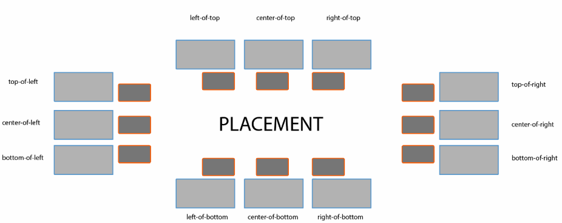

# Get-position util
A utility that helps positioning one element, relative to another. The element to be positioned will be either fixed or absolute, but will be aligned with the element it is relative to. There are 12 options for how it is positioned.

## Features
- 12 positions:

- Fixed or absolute positioning for the element.
- Checks for available space and changes position if there is not enough space in the preferred position.

## Flow
The `getPosition` function is called from the `manage-position` util, which essentially just handles styling and attributes to be applied to the elements to be positioned.

From `getPosition()` the flow is at follows:
- `getPosition` is called with the position-context and config.
- From the config, the position argument is evaluated and extracted into a vertical and horizontal argument, as well as evaluating whether horizontal is the primary argument or the secondary (`top-of-left` vs `left-of-top`).
- Then, the vertical direction is evaluated:
  - It starts by checking which vertical directions are, not taking into account the preferred direction.
  - These are `top` and `bottom`, and also `center` if the horizontal argument is the primary one.
  - For each of these directions, the amount of space is calculated using `getAvailableSpace()`.
  - Lastly, it is evaluated whether for the preferred direction, the available space is enough.
  - If not, the direction with the most available space is taken as the alternative.
- The exact same is done for the horizontal direction, but for `left`, `right` and `center` if the horizontal argument is the secondary one.
- The maximum height and width are set based on the available space of the directions that were returned from the previous steps.
- The `top` and `left` CSS properties are computed based on the final position and maximum height and width.
