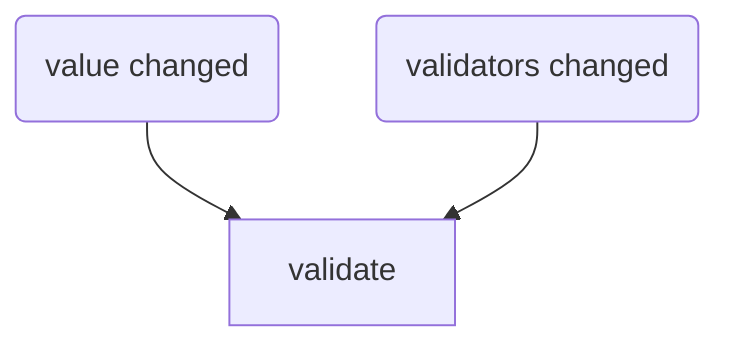
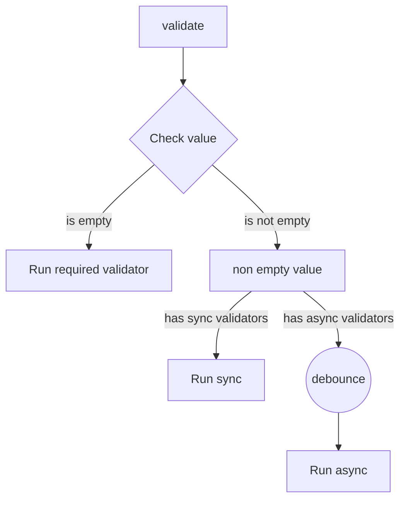

```mermaid
graph TD
  A(value changed) --> validate
  B(validators changed) --> validate
```

```mermaid
graph TD
  validate --> B{Check value}
  B -->|is empty| C[Run required validator]
  B -->|is not empty| syncOrAsync[non empty value]
  syncOrAsync -->|has sync validators| F[Run sync]
  syncOrAsync -->|has async validators| G((debounce))
  G --> H[Run async]
```
